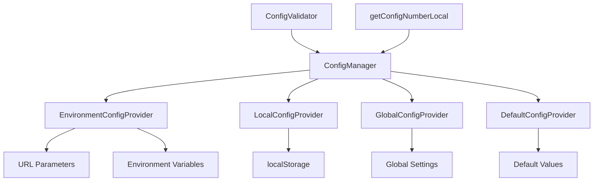

# Planet Aggregator v2 - 設定システム改善

## 概要

Planet Aggregator v2の設定システムを設定プロバイダーパターンを使用して改善しました。これにより、設定の複雑性を軽減し、型安全性と保守性を向上させています。

## 改善前の問題点

### 1. 複雑な設定取得ロジック
```javascript
// 改善前
function getConfigNumberLocal(key, defaultValue = 0) {
    if (typeof window !== 'undefined' && typeof window.getConfigNumber === 'function') {
        return window.getConfigNumber(key, defaultValue);
    }
    return defaultValue;
}
```

**問題点:**
- 設定の優先順位が不明確
- エラーハンドリングが不十分
- 型安全性が保証されていない
- 設定の検証機能がない

### 2. 設定の分散と重複
- `CONFIG`定数（config-manager.js）
- `data-sources.json`の設定
- 各アダプタークラス内のデフォルト設定
- グローバル設定とローカル設定の混在

## 改善後のアーキテクチャ

### 設定プロバイダーパターン



### 優先順位（高い順）
1. **環境設定** (EnvironmentConfigProvider) - URL パラメータ、環境変数
2. **ローカル設定** (LocalConfigProvider) - localStorage
3. **グローバル設定** (GlobalConfigProvider) - グローバル設定
4. **デフォルト設定** (DefaultConfigProvider) - デフォルト値

## 新機能

### 1. 統一された設定取得
```javascript
// 改善後
function getConfigNumberLocal(key, defaultValue = 0) {
    // 新しい設定プロバイダーシステムが利用可能な場合はそれを使用
    if (typeof window !== 'undefined' && window.configManager) {
        return window.configManager.getNumber(key, defaultValue);
    }
    
    // 後方互換性のため、従来の設定管理システムもサポート
    if (typeof window !== 'undefined' && typeof window.getConfigNumber === 'function') {
        return window.getConfigNumber(key, defaultValue);
    }
    
    // フォールバック: 直接デフォルト値を返す
    console.warn(`設定値 ${key} を取得できません。デフォルト値 ${defaultValue} を使用します。`);
    return defaultValue;
}
```

### 2. 型安全な設定取得
```javascript
// 数値設定
const timeout = configManager.getNumber('REQUEST_TIMEOUT', 10000);

// 文字列設定
const displayName = configManager.getString('displayName', '');

// ブール設定
const useProxy = configManager.getBoolean('useProxy', true);

// 配列設定
const sources = configManager.getArray('dataSources', []);

// オブジェクト設定
const limits = configManager.getObject('UI_LIMITS', {});
```

### 3. 設定値の検証
```javascript
// 設定値の検証
const isValid = configValidator.isValid('MAX_POSTS', 50);

// 設定オブジェクト全体の検証
const report = configValidator.generateReport(config);

// 設定値の検証と修正
const validatedValue = configValidator.validate('CACHE_DURATION', 60000);
```

### 4. 設定の動的更新
```javascript
// 設定値の更新
configManager.set('MAX_POSTS', 30);

// 設定の一覧取得
const allKeys = configManager.getAllKeys();

// 設定の詳細情報取得
const info = configManager.getConfigInfo('MAX_POSTS');
```

## 設定検証ルール

### 数値設定の例
```javascript
'CACHE_DURATION': {
    type: 'number',
    min: 60000,        // 1分
    max: 3600000,      // 1時間
    default: 30 * 60 * 1000,
    description: 'キャッシュ期間（ミリ秒）'
}
```

### 文字列設定の例
```javascript
'sourceIconImage': {
    type: 'string',
    pattern: /^(https?:\/\/|\/|\.\/|\.\.\/).*\.(png|jpg|jpeg|gif|webp|svg)$/i,
    default: '',
    description: 'ソースアイコン画像URL'
}
```

### ブール設定の例
```javascript
'useProxy': {
    type: 'boolean',
    default: true,
    description: 'プロキシの使用'
}
```

## 使用方法

### 1. 基本的な設定取得
```javascript
// 数値設定の取得
const maxPosts = getConfigNumberLocal('UI_LIMITS.MAX_POSTS', 20);

// 文字列設定の取得
const displayName = getConfigStringLocal('displayName', '');

// ブール設定の取得
const useProxy = getConfigBooleanLocal('useProxy', true);
```

### 2. 設定の検証
```javascript
// 設定値の妥当性チェック
if (isConfigValid('MAX_POSTS', 50)) {
    console.log('設定値は有効です');
} else {
    console.log('設定値が無効です');
}

// 設定の検証レポート生成
const report = getConfigReport(currentConfig);
console.log('検証結果:', report);
```

### 3. 設定のヘルプ表示
```javascript
// 設定のヘルプ情報を表示
const help = getConfigHelp();
console.log('設定ヘルプ:', help);

// 特定の設定の説明を取得
const description = configValidator.getDescription('MAX_POSTS');
console.log('MAX_POSTSの説明:', description);
```

## 設定の優先順位

1. **環境変数** (`PLANET_CONFIG_*`)
2. **URL パラメータ** (`?config.maxPosts=30`)
3. **localStorage** (`planet-v2-local-config`)
4. **グローバル設定** (data-sources.json)
5. **デフォルト値** (CONFIG定数)

## エラーハンドリング

### 設定検証エラー
```javascript
try {
    const value = validateConfigValue('MAX_POSTS', -1, true);
} catch (error) {
    if (error instanceof ConfigValidationError) {
        console.error(`設定エラー: ${error.message}`);
        console.error(`キー: ${error.key}, 値: ${error.value}`);
    }
}
```

### 設定取得エラー
```javascript
// 安全な設定取得（エラー時はデフォルト値を使用）
const value = getConfigNumberLocal('INVALID_KEY', 100);
// 結果: 100（デフォルト値）
```

## 後方互換性

既存のコードは変更なしで動作します：

```javascript
// 既存のコードはそのまま動作
const timeout = getConfigNumberLocal('REQUEST_TIMEOUT', 10000);
const displayName = getConfigStringLocal('displayName', '');
const useProxy = getConfigBooleanLocal('useProxy', true);
```

## パフォーマンス

### キャッシュ機能
- 設定値は5秒間キャッシュされます
- 頻繁にアクセスされる設定値の取得が高速化されます

### 遅延読み込み
- 設定プロバイダーは必要時にのみ初期化されます
- メモリ使用量を最小限に抑えます

## デバッグ機能

### 設定の詳細情報
```javascript
// 設定の詳細情報を取得
const info = configManager.getConfigInfo('MAX_POSTS');
console.log('設定情報:', info);
/*
{
    key: 'MAX_POSTS',
    value: 20,
    hasValue: true,
    providers: [
        {
            index: 0,
            priority: 200,
            value: 20,
            type: 'EnvironmentConfigProvider'
        }
    ]
}
*/
```

### 設定の検証レポート
```javascript
const report = getConfigReport(config);
console.log('検証レポート:', report);
/*
{
    valid: true,
    errors: [],
    warnings: [],
    validatedConfig: { ... },
    summary: {
        totalKeys: 15,
        validKeys: 15,
        errorCount: 0,
        warningCount: 0
    }
}
*/
```

## 今後の拡張

### 1. 設定の動的更新
- 設定変更時の自動再読み込み
- 設定変更の通知システム

### 2. 設定のインポート/エクスポート
- 設定のバックアップ機能
- 設定の共有機能

### 3. 設定のUI
- 設定変更用のWebインターフェース
- 設定の可視化

## まとめ

設定プロバイダーパターンの導入により、以下の改善を実現しました：

1. **複雑性の軽減**: 設定の優先順位が明確になり、理解しやすくなりました
2. **型安全性の向上**: 設定値の型が保証され、実行時エラーを防げます
3. **保守性の向上**: 設定の検証機能により、設定ミスを早期発見できます
4. **拡張性の向上**: 新しい設定プロバイダーを簡単に追加できます
5. **後方互換性**: 既存のコードは変更なしで動作します

この改善により、Planet Aggregator v2の設定システムはより堅牢で保守しやすくなりました。
